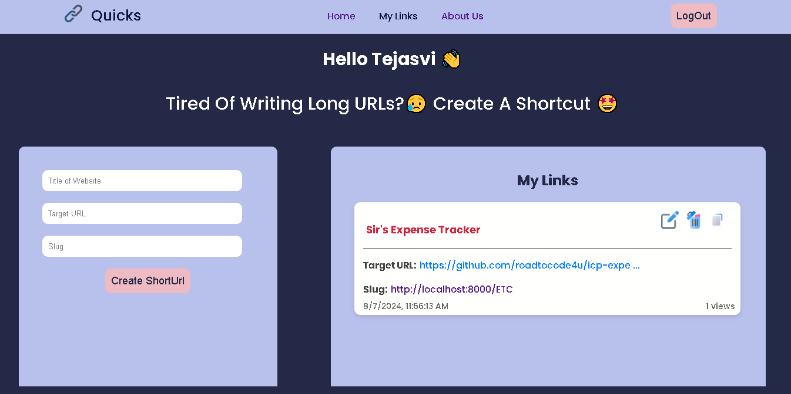
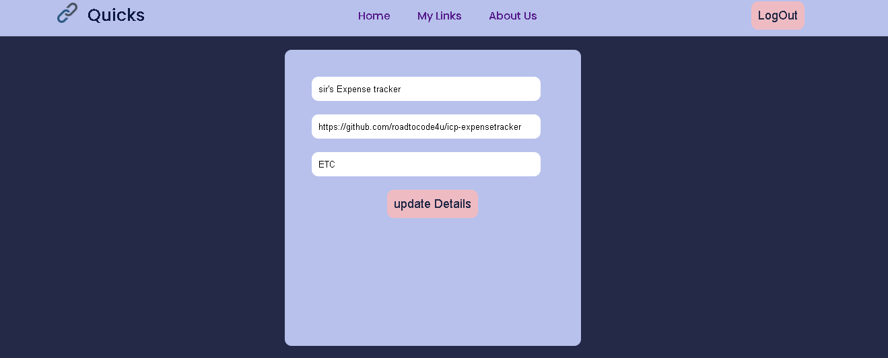
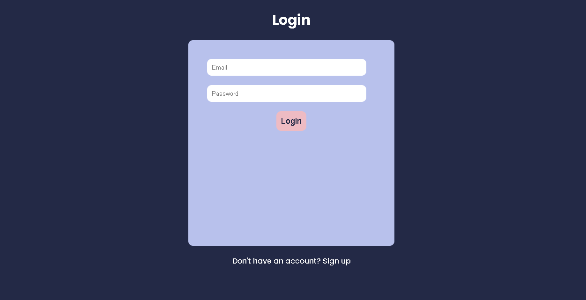
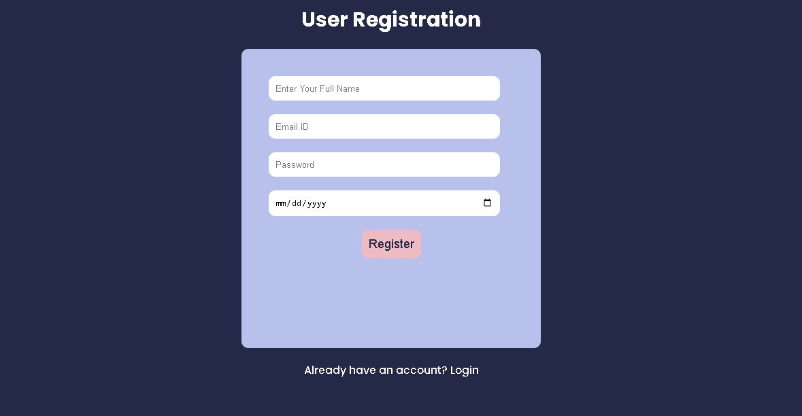

# Quick Links

**Quick Links** is a URL shortener web application that enables users to generate shortened URLs for long links. Built using the **MERN stack** (MongoDB, Express, React, and Node.js), this project allows users to manage their shortened links effectively, with functionalities for creating, viewing, and deleting URLs. The app aims to provide a smooth and user-friendly experience for managing links.

## Features

- **Custom URL Slug:** Allow users to create custom slugs for their shortened links.
- **User Authentication:** Add login and signup functionality to allow users to manage their personalized set of links.
- **URL Shortening:** Easily shorten any long URL into a concise, user-friendly link.
- **Link Management:** View and manage all your shortened links in one place.
- **Copy to Clipboard:** Quickly copy shortened links for easy sharing.
- **Delete Links:** Remove any unwanted or expired shortened links.
- **Analytics:** Add features to track how many times each shortened URL has been visited.
- **Responsive Design:** The app is fully responsive, making it accessible across all device sizes.

## Tech Stack

### Frontend (Client Side)
- **React:** Provides the user interface for the application.
- **Axios:** Handles HTTP requests to the backend for creating and managing links.
- **React Hot Toast:** Displays user notifications for actions such as successful URL creation or deletion.
- **React Router DOM:** Manages navigation between different pages in the application.

### Backend (Server Side)
- **Node.js:** JavaScript runtime that powers the server-side logic.
- **Express:** Web framework used for routing and handling API requests.
- **MongoDB & Mongoose:** NoSQL database and ORM for storing original and shortened URLs.
- **CORS:** Middleware for enabling cross-origin requests between frontend and backend.
- **dotenv:** Manages environment variables securely.
- **Nodemon:** Automatically restarts the server during development for faster iterations.

## API Endpoints

- **POST /shorten:** Shorten a new long URL.
- **GET /links:** Retrieve all shortened links for the user.
- **DELETE /link/:id:** Delete a specific shortened link.

## How It Works

1. **Shortening URLs:** Users can input a long URL in the form, which will be shortened and saved to the database.
2. **Link Management:** All shortened links are displayed on the home page, where users can view, copy, or delete them.
3. **Deleting URLs:** Users can easily remove any shortened URLs they no longer need.
4. **Copy Links:** Each shortened URL has a "Copy" button for easy sharing.
5. **Custom URL Slug:** Allow users to create custom slugs for their shortened links.
6. **User Authentication:** Add login and signup functionality to allow users to manage their personalized set of links.

## Screenshots

### 1. Home Page

### 2. Update Link

### 3. Login

### 4. Signup

## Future Enhancements

- **Link Expiry:** Implement link expiration based on user-specified time.
- **QR Code Generation:** Generate QR codes for each shortened link for easier mobile access.
